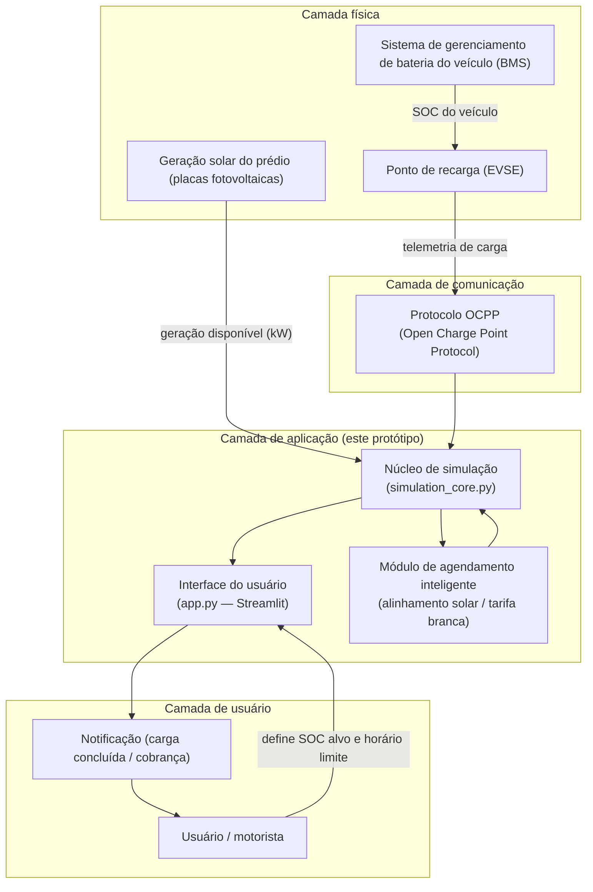
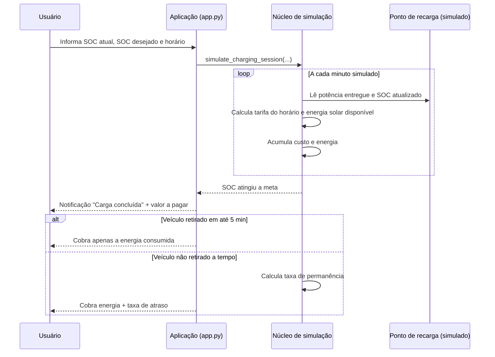

# Integrantes:
Anna Luiza Carvalhaes - 573330  
Gabriela Batista - 573583
kethelyn Oliveira - 574016
Samara Carvalho - 573666

# Sistema Inteligente de Gerenciamento de Recarga de Veículos Elétricos (VEs)
### Protótipo funcional — Sprint 1
**Disciplina:** CHALLENGE — Python e Energias Renováveis
**Contexto:** Prédios comerciais com pontos de recarga de VEs

---

## 1. Visão geral da solução

O sistema gerencia sessões de recarga de veículos elétricos em
pontos de recarga (EVSE — *Electric Vehicle Supply Equipment*) instalados em
estacionamentos de prédios comerciais. Ele:

1. Conecta-se ao ponto de recarga e lê o estado de carga (SOC) do veículo;
2. Calcula o tempo estimado até a carga desejada pelo usuário;
3. Notifica o usuário automaticamente quando a meta de SOC é atingida;
4. Calcula e informa o valor a pagar pela energia consumida;
5. Aplica uma **taxa de permanência** caso o veículo não seja retirado do
   ponto de recarga em até **5 minutos** após a conclusão da carga.

Este repositório contém o **protótipo simulado da Sprint 1**, que comprova a
viabilidade técnica do núcleo de cálculo (energia, tempo, tarifação,
notificação e taxa de atraso) e uma funcionalidade adicional de
**agendamento inteligente alinhado à geração solar**, que conecta a solução
diretamente aos princípios de energias renováveis trabalhados no semestre.

---

## 2. Arquitetura do sistema

### 2.1 Visão em camadas



> Em produção, a comunicação com o carregador seguiria o padrão **OCPP**
> (protocolo aberto amplamente usado por *Charging Station Management
> Systems* reais), o que confere aderência da arquitetura a um padrão de
> mercado real. Neste protótipo, a leitura do SOC e a telemetria do
> carregador são **simuladas** dentro de `simulation_core.py`, mas a
> separação em camadas foi mantida para que a troca do "SOC simulado" por
> uma leitura real via OCPP não exija reescrever a lógica de negócio.

### 2.2 Fluxo de uma sessão de recarga



### 2.3 Módulos do protótipo

| Arquivo | Responsabilidade |
|---|---|
| `simulation_core.py` | Lógica pura: cálculo de energia, tempo de carga, tarifação por horário (tarifa branca), geração solar simulada, taxa de permanência e otimização de horário de início. Sem dependência de interface — testável isoladamente. |
| `database.py` | Camada de persistência (SQLite local, `recargas.db`): grava cada sessão simulada como uma linha e permite consultar o histórico completo. |
| `app.py` | Interface Streamlit: coleta parâmetros do usuário, chama o núcleo de simulação, salva o resultado no banco, exibe métricas, gráficos, a tabela-resumo da sessão, o histórico completo e a comparação de cenários. |
| `requirements.txt` | Dependências do protótipo. |

A persistência em SQLite foi adicionada porque um dos critérios da atividade
é "apresentar dados gerados pelo sistema" — com o banco, o protótipo não
mostra apenas a última simulação, mas acumula um histórico real de sessões,
que pode inclusive ser reaproveitado depois para análises de consumo ao
longo do tempo (ex.: horário de maior demanda no prédio).

Essa separação segue o princípio de arquitetura em camadas (lógica de
domínio isolada da interface), o que facilita tanto os testes quanto uma
futura evolução para um backend real (ex.: API REST + banco de dados +
integração OCPP com o carregador físico).

---

## 3. Justificativa técnica dos componentes

### 3.1 Eficiência energética
- **Perdas de conversão AC/DC (92%)**: todo carregador possui perdas na
  conversão de corrente alternada (rede) para corrente contínua (bateria).
  O protótipo calcula a energia **realmente retirada da rede**, não apenas a
  energia útil entregue à bateria — isso é essencial para que a cobrança e
  a análise de consumo reflitam a realidade física do sistema.
- **Taxa de permanência (5 min de tolerância)**: um ponto de recarga ocioso
  após a conclusão da carga é um ativo de infraestrutura subutilizado. Ao
  desestimular a permanência desnecessária, o sistema aumenta o *turnover*
  dos pontos de recarga, reduzindo a necessidade de instalar mais pontos
  físicos (menos consumo de materiais e energia embutida na infraestrutura).

### 3.2 Sustentabilidade e energias renováveis
- **Tarifa Branca (ANEEL)**: o preço da energia varia conforme o horário
  (ponta, intermediário, fora de ponta). O sistema já contabiliza essa
  variação na cobrança, criando o incentivo econômico correto para deslocar
  o consumo para horários mais baratos e menos carregados na rede.
- **Alinhamento com geração solar local**: a aba de comparação do
  protótipo demonstra que, ao atrasar o início da recarga (respeitando o
  prazo do usuário), o sistema consegue cobrir uma fração maior da energia
  necessária com **geração solar do próprio prédio**, reduzindo a
  dependência da rede elétrica e a pegada de carbono associada à recarga.
  Esse é o principal elo entre a solução e os conceitos de energias
  renováveis trabalhados no semestre.
- **Redução de picos de demanda**: ao evitar o horário de ponta sempre que
  possível, o sistema contribui para achatar a curva de demanda do prédio,
  um objetivo central de eficiência energética em edificações comerciais.

### 3.3 Padrão de mercado (OCPP)
A referência ao protocolo **OCPP** na arquitetura não é decorativa: é o
padrão aberto usado por sistemas reais de gerenciamento de pontos de
recarga para trocar mensagens como `StartTransaction`, `MeterValues`
(leituras de energia) e `StopTransaction`. Estruturar o protótipo em
camadas (comunicação → domínio → interface) significa que, para evoluir
este projeto para um sistema real, bastaria substituir a simulação de SOC
por um cliente OCPP conectado a um carregador físico, sem alterar a lógica
de cálculo já validada.

---

## 4. Dados gerados pelo sistema (prova de conceito)

O protótipo gera, para cada sessão simulada:
- Série temporal minuto a minuto de SOC, potência entregue, tarifa vigente
  e custo acumulado (exibida em tabela na aba "Simulação da sessão");
- Uma **tabela-resumo** da sessão logo após a simulação, com todos os
  parâmetros de entrada e resultados (capacidade, SOC inicial/alvo,
  potência, horário, energia consumida, energia solar, custo, taxa de
  atraso e valor total);
- Um **histórico persistente** (tabela `recargas` em `recargas.db`, SQLite):
  cada simulação rodada fica registrada, permitindo visualizar e comparar
  várias sessões ao longo do tempo — não apenas a última;
- Comparativo entre recarga imediata e recarga com agendamento
  inteligente, incluindo economia em R$ e ganho de energia solar
  aproveitada (kWh).

Esses dados simulados foram validados manualmente contra as fórmulas de
energia e tempo (ver seção de testes abaixo), garantindo que a simulação é
tecnicamente fundamentada e não apenas ilustrativa.

---

## 5. Como executar o protótipo

```bash
# 1. Criar ambiente virtual (opcional, recomendado)
python3 -m venv venv
source venv/bin/activate        # Windows: venv\Scripts\activate

# 2. Instalar dependências
pip install -r requirements.txt

# 3. Executar a aplicação
streamlit run app.py
```

O navegador abrirá automaticamente em `http://localhost:8501`.

### 5.1 Roteiro sugerido de demonstração
1. Na aba **"Simulação da sessão"**, ajuste SOC inicial/desejado e clique em
   **"Iniciar simulação de recarga"** — mostre a notificação de carga
   concluída, o valor a pagar e o gráfico de evolução do SOC.
2. Aumente o "Tempo até o usuário retirar o veículo" para acima de 5 min e
   rode novamente — mostre a taxa de permanência sendo aplicada.
3. Vá para a aba **"Comparativo: imediato vs. inteligente"**, defina um
   horário limite mais distante e clique em **"Comparar cenários"** — mostre
   a economia de custo e o ganho de energia solar aproveitada.

### 5.2 Validação da lógica (testes manuais)
As funções de `simulation_core.py` foram validadas com casos de teste
manuais que conferem:
- O cálculo de energia e tempo de carga contra a fórmula física
  `E = capacidade × ΔSOC / eficiência` e `t = E / potência`;
- A aplicação correta da taxa de permanência apenas acima da tolerância de
  5 minutos, no valor `(atraso − 5) × R$ 2,00/min`;
- Que o agendamento inteligente nunca produz um horário de início que viole
  o prazo (deadline) informado pelo usuário.

---

## 6. Limitações do protótipo e próximos passos

- A leitura do SOC e a geração solar são **simuladas** (não há hardware
  real conectado) — próximo passo natural é integrar um cliente OCPP real.
- A tarifa branca usa valores **ilustrativos**; uma versão futura poderia
  buscar tarifas reais publicadas pela distribuidora local via API.
- O agendamento inteligente usa busca exaustiva simples; um sistema em
  produção poderia usar otimização mais sofisticada (ex. programação
  linear) para múltiplos veículos disputando os mesmos pontos de recarga
  simultaneamente.

---

## 7. Vídeo técnico de demonstração
*(Adicionar aqui o link do vídeo após a gravação — ver roteiro sugerido na
seção 5.1. O vídeo deve mostrar: (1) o problema e a proposta, (2) a
simulação de uma sessão de recarga com e sem atraso, (3) o comparativo de
agendamento inteligente e sua justificativa de sustentabilidade, (4) uma
conclusão amarrando os resultados aos princípios de energias renováveis.)*
